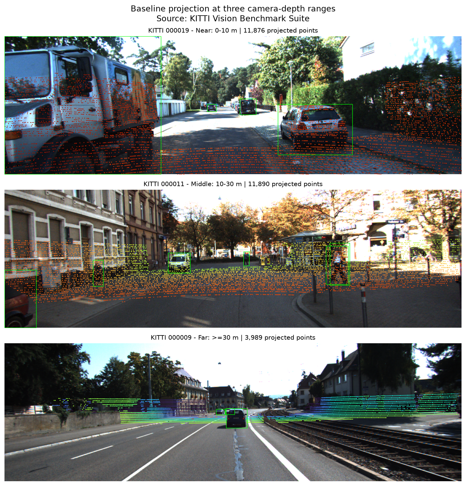
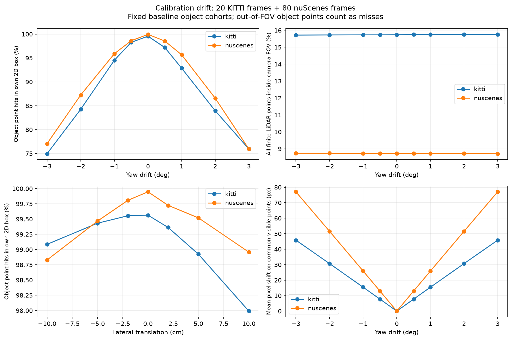
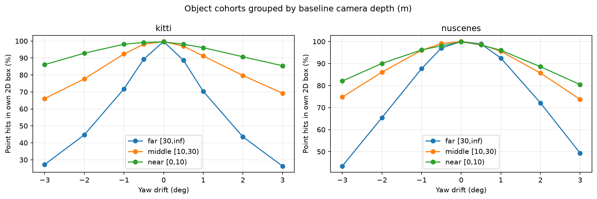
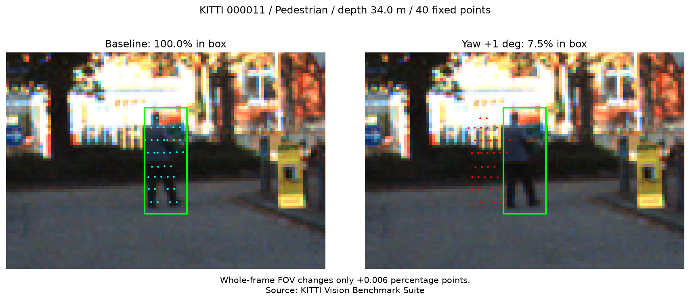

# Báo cáo Day 6: Độ nhạy của projection LiDAR–camera với calibration drift

- **Họ tên:** Nguyễn Hoàng Sơn
- **MSSV:** 2A202602457
- **Lớp:** Track 4
- **Link repo:** https://github.com/sown101/NguyenHoangSon-2A202602457-Track4-Day21
- **Topic:** A — LiDAR-camera projection QA, mức Basic và Good.
- **Dataset:** `data/synthetic` để kiểm tra CP2; `data/kitti_mini` và `data/nuscenes_mini_subset` cho thí nghiệm chính.
- **Các frame đã dùng:** KITTI: 000001, 000004, 000007, 000008, 000009, 000010, 000011, 000012, 000015, 000016, 000019, 000021, 000023, 000025, 000031, 000032, 000043, 000048, 000049, 000061; nuScenes: scene-0103_000 đến scene-0103_039 và scene-1094_000 đến scene-1094_039; synthetic: 000000 đến 000004 cho data health, 000000 cho projection.

## 1. Claim

Trên 20 frame KITTI được cung cấp, yaw +1° làm tỷ lệ điểm thuộc object chiếu vào đúng 2D box giảm từ **99,56% xuống 92,87%** (−6,69 điểm phần trăm), trong khi tỷ lệ toàn bộ điểm hữu hạn trong FOV chỉ đổi từ **15,7396% lên 15,7498%**; vì vậy FOV toàn frame không đủ để kiểm tra alignment của từng object.

## 2. Evidence

Chuỗi chiếu là `P2 · R0_rect · Tr_velo_to_cam · [x,y,z,1]ᵀ`, chia hai thành phần đầu cho thành phần thứ ba; lọc NaN/Inf, `z_cam ≤ 0,1 m` và pixel ngoài ảnh. Kiểm tra điểm synthetic `(10,0,0)` cho `z_cam = 9,7273 m`, `(u,v) = (613,964; 175,007)`; cả 5 test hình học đều PASS.

Thí nghiệm dùng 9 mức yaw `−3, −2, −1, −0,5, 0, +0,5, +1, +2, +3°` và 7 mức dịch ngang `−10, −5, −2, 0, +2, +5, +10 cm`, thay đổi từng yếu tố riêng; dịch ngang theo y của KITTI và x của nuScenes, yaw quanh z của LiDAR. Seed 457 chỉ dùng lấy mẫu để vẽ, metric dùng toàn bộ điểm. Mỗi object giữ nguyên tập điểm nằm trong GT 3D box và FOV ở baseline, tối thiểu 10 điểm; có 107 object-frame KITTI và 292 object-frame nuScenes.

**Định nghĩa:** FOV (%) = 100 × số điểm chiếu hợp lệ / số điểm XYZ hữu hạn; đúng box (%) = 100 × tổng điểm chiếu vào 2D box tương ứng / tổng điểm trong các tập object baseline. Đây là trung bình có trọng số theo số điểm, điểm ra ngoài ảnh tính là miss; box chồng nhau có thể tính một điểm nhiều lần. Độ dịch pixel trung bình chỉ tính trên điểm hợp lệ ở cả baseline và cấu hình lệch.

| Dataset | Cấu hình | Đúng box (%) | Trong FOV (%) | Dịch pixel TB (px) |
|---|---|---:|---:|---:|
| KITTI | Baseline | 99,5642 | 15,7396 | 0,000 |
| KITTI | Yaw −1° | 94,5263 | 15,7304 | 15,424 |
| KITTI | Yaw +0,5° | 97,2009 | 15,7466 | 7,732 |
| KITTI | Yaw +1° | 92,8728 | 15,7498 | 15,424 |
| KITTI | Yaw +2° | 83,9576 | 15,7514 | 30,696 |
| KITTI | Yaw +3° | 75,9538 | 15,7597 | 45,822 |
| KITTI | Dịch ngang +5 cm | 98,9242 | 15,7435 | 3,298 |
| KITTI | Dịch ngang +10 cm | 97,9903 | 15,7456 | 6,585 |
| nuScenes | Baseline | 99,9473 | 8,7266 | 0,000 |
| nuScenes | Yaw +1° | 95,6860 | 8,7234 | 25,877 |
| nuScenes | Yaw +2° | 86,5839 | 8,7176 | 51,554 |
| nuScenes | Yaw +3° | 75,9600 | 8,7117 | 77,047 |
| nuScenes | Dịch ngang +5 cm | 99,5200 | 8,7259 | 5,779 |
| nuScenes | Dịch ngang +10 cm | 98,9581 | 8,7238 | 11,543 |

CSV đầy đủ: [tổng hợp](../results/calibration_summary.csv), [từng frame](../results/calibration_frames.csv), [từng object](../results/calibration_objects.csv), [theo khoảng cách](../results/calibration_ranges.csv). Chạy lại toàn bộ thí nghiệm cho 1.600 dòng frame/cấu hình và 6.384 dòng object/cấu hình; các CSV metric và JSON failure trùng SHA-256 với lần chạy trước.



Ba ảnh riêng: [gần 0–10 m, frame 000019](../results/figures/demo_000019.png), [10–30 m, frame 000011](../results/figures/demo_000011.png), [xa ≥30 m, frame 000009](../results/figures/demo_000009.png); số điểm chiếu tương ứng 11.876, 11.890 và 3.989 trong [demo_ranges.csv](../results/demo_ranges.csv). Khoảng cách ở đây là depth camera; hình được lấy mẫu tối đa 6.000 điểm để dễ xem. Nguồn ảnh: KITTI Vision Benchmark Suite; [demo nuScenes](../results/figures/demo_nuscenes.png): nuScenes (Motional).





Với KITTI, yaw +1° làm nhóm gần giảm từ 99,49% xuống 96,08%, nhóm 10–30 m từ 99,65% xuống 91,17%, nhóm ≥30 m từ 99,71% xuống 70,35%. Độ dịch pixel TB của nuScenes lớn hơn KITTI; có thể liên quan đến intrinsics và ảnh 1600×900 so với khoảng 1242×375. Tỷ lệ FOV còn phụ thuộc cảnh và góc nhìn; khác biệt số beam (32 so với 64), khoảng cách và kích thước object ảnh hưởng mẫu điểm, nên không suy ra sensor nào tốt hơn từ bảng này.

**Giới hạn so sánh:** loader nuScenes bù chuyển động ego giữa LiDAR và camera nhưng không bù chuyển động riêng của object; 2D box nuScenes được tạo từ phép chiếu 3D box bằng cùng calibration, nên không phải nhãn 2D độc lập. Tỷ lệ baseline gần 100% trên nuScenes vì vậy không chứng minh calibration thực tế hoàn hảo. Thí nghiệm đo độ nhạy hình học, không đo recall detector hay hiệu quả phát hiện drift trên dữ liệu triển khai.

**Latency:** bỏ lượt warm-up, đo 30 lần projection trên frame đầu mỗi dataset, không tính đọc file, vẽ ảnh hay tìm điểm trong GT box. KITTI p50/p95 = **31,757/40,428 ms**, nuScenes = **7,349/8,167 ms**; Windows 11, Python 3.13.1, CPU `AMD64 Family 25 Model 68 Stepping 1, AuthenticAMD`, không dùng GPU. Số đo từng lần nằm ở [projection_latency.csv](../results/projection_latency.csv), cấu hình và phiên bản thư viện ở [experiment_metadata.json](../results/experiment_metadata.json); latency thay đổi theo tải máy.

## 3. Failure case



Frame KITTI **000011**, object index **3**, Pedestrian có depth trung vị **34,02 m**: 40/40 điểm nằm trong box ở baseline, còn **3/40 điểm (7,5%)** khi yaw +1°. Trong cùng frame, FOV chỉ tăng từ **18,467835% lên 18,473390%** (+0,005555 điểm phần trăm). Một quy tắc chỉ cảnh báo khi FOV đổi ≥0,5 điểm phần trăm sẽ bỏ sót lỗi này; ngưỡng này là ví dụ minh họa, chưa được hiệu chỉnh trên tập kiểm định.

Nguyên nhân thuộc **Geometry**: xoay extrinsic làm điểm rời khỏi box hẹp của người đi bộ dù vẫn nằm trong ảnh; cách dùng FOV toàn frame để thay cho alignment còn gây lỗi **Metric**. Tỷ lệ đúng box toàn frame giảm từ 99,45% xuống 70,07%, cho thấy cần kiểm tra object/vùng ảnh thay vì chỉ kiểm tra FOV. Khi triển khai, theo dõi alignment theo vùng và kiểm tra lại calibration sau va chạm; tổng hợp theo khoảng cách và loại object để tránh vật lớn, nhiều điểm che lấp lỗi ở vật nhỏ. Số liệu truy vết trong [failure_case.json](../results/failure_case.json).

## 4. Khuyến nghị nếu triển khai thật

Với ADAS dùng LiDAR–camera fusion, kiểm tra projection trước khi đưa điểm vào camera ROI; ghi log tỷ lệ invalid, FOV, độ lệch timestamp, số điểm theo khoảng cách và alignment theo vùng. Ưu tiên kiểm tra pedestrian/cyclist xa vì box hẹp, ít điểm; failure ở 34 m cho thấy yaw 1° đã có thể gây sai lệch lớn.

FOV rẻ và hữu ích để phát hiện lỗi nghiêm trọng, nhưng cần kết hợp chỉ số alignment; khi không có GT, thử depth edge–image edge hoặc landmark tĩnh rồi xác minh trên dữ liệu riêng. Lấy mẫu để giám sát giảm chi phí nhưng có thể bỏ qua object thưa; cần ngưỡng theo sensor, cảnh và số điểm, đồng thời cảnh báo khi thiếu bằng chứng. Bước tiếp theo là kiểm định ngưỡng trên scene độc lập, tách ngày/đêm và thêm vật chuyển động; chưa dùng kết quả offline này làm quyết định an toàn tự động.

## 5. Cách chạy lại

Chạy từ thư mục gốc repo bằng Windows PowerShell, Python 3.13.1. `requirements-lock.txt` ghi đúng phiên bản môi trường tạo kết quả; `requirements.txt` là danh sách thư viện tối thiểu và đã khai báo UTF-8 để pip trên Windows đọc được.

```powershell
python -m venv .venv
.\.venv\Scripts\Activate.ps1
python -m pip install -r requirements-lock.txt
python -m pip check
python tools/verify_data.py --data-root data/kitti_mini
python tools/verify_data.py --data-root data/nuscenes_mini_subset
python -m unittest src.test_projection -v
python -m starter.data_health --data-root data/synthetic
python -m starter.projection --data-root data/synthetic --frame 000000
python -m starter.projection --data-root data/kitti_mini --frame 000011
python -m starter.projection --data-root data/nuscenes_mini_subset --frame scene-0103_010
python -m src.calibration_benchmark --help
python -m src.calibration_benchmark --datasets kitti nuscenes --seed 457 --min-object-points 10 --latency-repeats 30
python tools/check_submission.py
```

## 6. Khai báo sử dụng AI

| Công cụ | Dùng cho việc gì | Cách kiểm chứng đã thực hiện |
|---|---|---|
| OpenAI Codex | Hỗ trợ giải thích/sửa lỗi encoding của pip; hỗ trợ code projection, benchmark, test, biểu đồ và hoàn thiện báo cáo | Chạy pip check và 5 test hình học, gồm điểm synthetic biết trước, NaN/Inf, depth, biên ảnh, thứ tự biến đổi và phép chia đồng nhất; kiểm tra checksum dữ liệu; chạy lại 100 frame và đối chiếu SHA-256 của CSV metric/JSON failure; mở xem ảnh demo, biểu đồ và failure; lấy số liệu từ output thực tế. |
